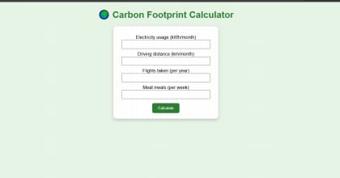
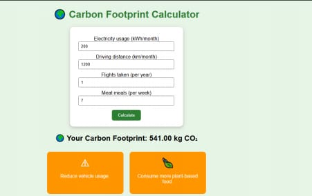

# 🌍 Carbon Footprint Calculator

A beginner-friendly web-based Carbon Footprint Calculator that estimates a user's carbon emissions based on electricity usage, driving distance, flights taken, and meat consumption.

## 📌 Features

- Calculates estimated carbon footprint
- Takes electricity usage as input
- Takes monthly driving distance
- Takes flights taken per year
- Takes meat meals per week
- Classifies the footprint as:
  - 🌱 Low
  - ⚠️ Moderate
  - 🚨 High
- Provides precautions to help reduce carbon emissions

## 🛠️ Technologies Used

- HTML
- CSS
- JavaScript
- C++

## 📂 Project Files

- `index.html` – Website structure
- `style.css` – Website design
- `script.js` – Carbon footprint calculation and result display
- `carbon.cpp` – C++ implementation of the calculation

## 🧮 Calculation

The calculator uses approximate emission factors for electricity, transportation, flying, and food consumption to estimate the carbon footprint.

## 🎯 Purpose

The project aims to create awareness about individual carbon emissions and encourage environmentally responsible choices.
## 📸 Screenshots

### 1. Carbon Footprint Calculator

### 2. Carbon Footprint Result

## 👩‍💻 Author

Najwa Sana
